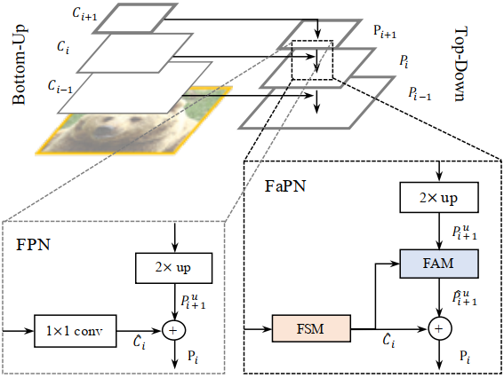

# FaPN: Feature-aligned Pyramid Network for Dense Image Prediction[[Project]](https://)[[arXiv]](https://)

```BibTex
@inproceedings{
  huang2021fapn,
  title={{FaPN}: Feature-aligned Pyramid Network for Dense Image Prediction},
  author={Shihua Huang and Zhichao Lu and Ran Cheng and Cheng He},
  booktitle={International Conference on Computer Vision (ICCV)},
  year={2021}
}
```

## Overview


This project provides the official implementation for our ICCV2021 paper 
"[FaPN: Feature-aligned Pyramid Network for Dense Image Prediction](https://arxiv.org/pdf/2108.07058.pdf)" 
based on [Detectron2](https://github.com/facebookresearch/detectron2). 
FaPN is a conceptually simple and effective framework for desne image prediction tasks,
which solves the feature misalignement in Feature Pyramid Networks.


### Code and trained models are coming soon. 


