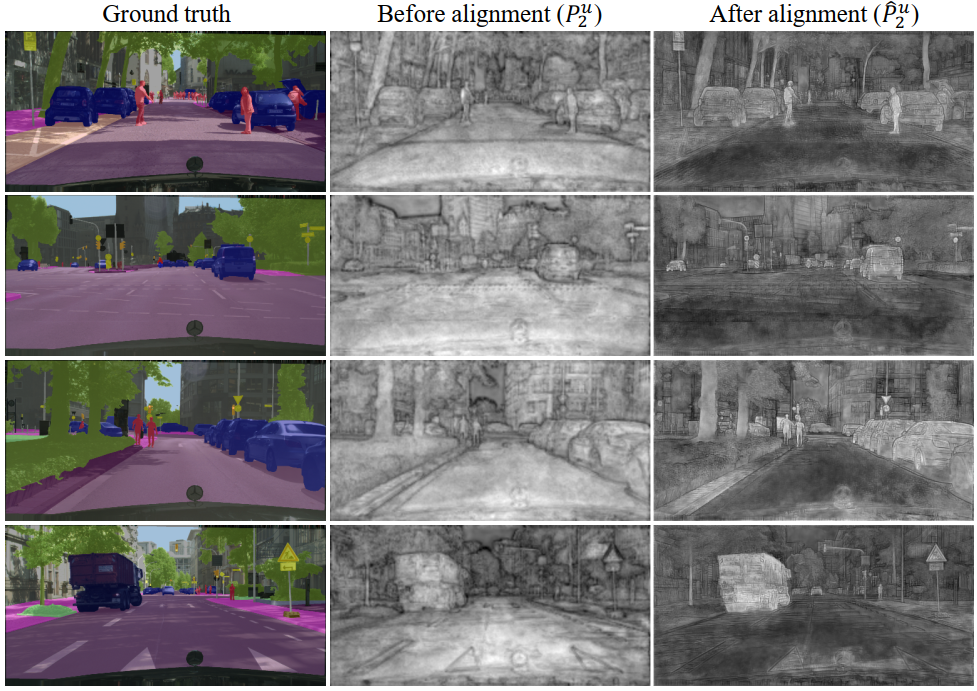

# FaPN: Feature-aligned Pyramid Network for Dense Image Prediction [[arXiv]](https://arxiv.org/pdf/2108.07058.pdf)

```BibTex
@inproceedings{
  huang2021fapn,
  title={{FaPN}: Feature-aligned Pyramid Network for Dense Image Prediction},
  author={Shihua Huang and Zhichao Lu and Ran Cheng and Cheng He},
  booktitle={International Conference on Computer Vision (ICCV)},
  year={2021}
}
```
## Overview

FaPN vs. FPN           |  Before vs. After Alignment
:-------------------------:|:-------------------------:
 |  

This project provides the official implementation for our ICCV2021 paper 
"[FaPN: Feature-aligned Pyramid Network for Dense Image Prediction](https://arxiv.org/pdf/2108.07058.pdf)" 
based on [Detectron2](https://github.com/facebookresearch/detectron2). 
FaPN is a simple yet effective top-down pyramidal architecture to generate multi-scale features for dense image prediction.
Comprised of a feature alignment module (FAM) and a feature selection module (FSM), FaPN addresses the issue of feature alignment
in  the original [FPN](https://arxiv.org/abs/1612.03144), leading to substaintial improvements on various dense prediction tasks, such as object detection, semantic, instance, panoptic segmentation, etc. 


## Installation
This project is based on [Detectron2](https://github.com/facebookresearch/detectron2), which can be constructed as follows.
* Install Detectron2 following [the instructions](https://detectron2.readthedocs.io/tutorials/install.html).
* Setup the dataset following [the structure](https://github.com/facebookresearch/detectron2/blob/master/datasets/README.md).
* Copy this project to `/path/to/detectron2`
* Install DCNv2 following [Install DCNv2.md](./DCNv2/README.md).

## Training
To train a model with 8 GPUs, run:
```bash
cd /path/to/detectron2/tools
python3 train_net.py --config-file <config.yaml> --num-gpus 8
```

For example, to launch Faster R-CNN training (1x schedule) with ResNet-50 backbone on 8 GPUs,
one should execute:
```bash
cd /path/to/detectron2/tools
python3 train_net.py --config-file ../configs\COCO-Detection\faster_rcnn_R_50_FAN_1x.yaml --num-gpus 8
```

## Evaluation
To evaluate a pre-trained model with 8 GPUs, run:
```bash
cd /path/to/detectron2/tools
python3 train_net.py --config-file <config.yaml> --num-gpus 8 --eval-only MODEL.WEIGHTS /path/to/model_checkpoint
```

## Results
### COCO Object Detection
#### Faster R-CNN + FaPN:
<table><tbody>
<!-- START TABLE -->
<!-- TABLE HEADER -->
<th valign="bottom">Name</th>
<th valign="bottom">lr<br/>sched</th>
<th valign="bottom">box<br/>AP</th>
<th valign="bottom">box<br/>APs</th>
<th valign="bottom">box<br/>APm</th>
<th valign="bottom">box<br/>APl</th>
<th valign="bottom">download</th>
<!-- TABLE BODY -->
<!-- ROW: faster_rcnn_R_50_FAN_1x -->
 <tr><td align="left"><a href="configs/COCO-Detection/faster_rcnn_R_50_FAN_1x.yaml">R50</a></td>
<td align="center">1x</td>
<td align="center">39.2</td>
<td align="center">24.5</td>
<td align="center">43.3</td>
<td align="center">49.1</td>
<td align="center"><a href="https://drive.google.com/file/d/16bws3mM-itTMBZvbBoBaJIm8bW7jLrTl/view?usp=sharing">model</a>&nbsp;|&nbsp;
<a href="https://drive.google.com/file/d/1cP0JJ98zNbqXDfx2g12qEF3i9wqyxzet/view?usp=sharing">log</a></td>
</tr>
 <tr><td align="left"><a href="configs/COCO-Detection/faster_rcnn_R_101_FAN_3x.yaml">R101</a></td>
<td align="center">3x</td>
<td align="center">42.8</td>
<td align="center">27.0</td>
<td align="center">46.2</td>
<td align="center">54.9</td>
<td align="center"><a href="https://drive.google.com/file/d/1KioARI3Be2LPG1MdIgiQeAL_KIlRXhNP/view?usp=sharing">model</a>&nbsp;|&nbsp;
<a href="https://drive.google.com/file/d/1a_8yvjIbV_uaNYKsN9sPhblcceHHG7SC/view?usp=sharing">log</a></td>
</tr>
</tbody></table>

### Cityscapes Semantic Segmentation
#### PointRend + FaPN:
<table><tbody>
<!-- START TABLE -->
<!-- TABLE HEADER -->
<th valign="bottom">Name</th>
<th valign="bottom">lr<br/>sched</th>
<th valign="bottom">mask<br/>mIoU</th>
<th valign="bottom">mask<br/>i_IoU</th>
<th valign="bottom">mask<br/>IoU_sup</th>
<th valign="bottom">mask<br/>iIoU_sup</th>
<th valign="bottom">download</th>
<!-- TABLE BODY -->
<!-- ROW: faster_rcnn_R_50_FAN_1x -->
 <tr><td align="left"><a href="./projects/PointRend/configs/SemanticSegmentation/pointrend_semantic_R_50_FAN_1x_cityscapes.yaml">R50</a></td>
<td align="center">1x</td>
<td align="center">80.0</td>
<td align="center">61.3</td>
<td align="center">90.6</td>
<td align="center">78.5</td>
<td align="center"><a href="https://drive.google.com/file/d/1R6af03eqnUufmYl7cf-eixbI_En8WN-8/view?usp=sharing">model</a>&nbsp;|&nbsp;
<a href="https://drive.google.com/file/d/1i7p9RLLF_CpHNxcY5WwlKYY8h9ANGdEs/view?usp=sharing">log</a></td>
</tr>
 <tr><td align="left"><a href="./projects/PointRend/configs/SemanticSegmentation/pointrend_semantic_R_101_FAN_1x_cityscapes.yaml">R101</a></td>
<td align="center">1x</td>
<td align="center">80.1</td>
<td align="center">62.2</td>
<td align="center">90.8</td>
<td align="center">78.6</td>
<td align="center"><a href="https://drive.google.com/file/d/1JSg9hweCIYZOhSceZAeF6CcbqIAiLKfr/view?usp=sharing">model</a>&nbsp;|&nbsp;
<a href="https://drive.google.com/file/d/1M_MUJXNbiHYlN2D9m1kxfM1KXGb2C3E0/view?usp=sharing">log</a></td>
</tr>
</tbody></table>

### COCO Instance Segmentation
#### Mask R-CNN + FaPN:
<table><tbody>
<!-- START TABLE -->
<!-- TABLE HEADER -->
<th valign="bottom">Name</th>
<th valign="bottom">lr<br/>sched</th>
<th valign="bottom">mask<br/>AP</th>
<th valign="bottom">mask<br/>APs</th>
<th valign="bottom">box<br/>AP</th>
<th valign="bottom">box<br/>APs</th>
<th valign="bottom">download</th>
<!-- TABLE BODY -->
 <tr><td align="left"><a href="./configs/COCO-InstanceSegmentation/mask_rcnn_R_50_FAN_1x.yaml">R50</a></td>
<td align="center">1x</td>
<td align="center">36.4</td>
<td align="center">18.1</td>
<td align="center">39.8</td>
<td align="center">24.3</td>
<td align="center"><a href="https://drive.google.com/file/d/1fNQw3v2d6C9BI3UF34iRqaWp2W48-Hl4/view?usp=sharing">model</a>&nbsp;|&nbsp;
<a href="https://drive.google.com/file/d/1BC2Fgex5s7biuTeBM0WpTJul_FyIdObq/view?usp=sharing">log</a></td>
</tr>
 <tr><td align="left"><a href="./configs/COCO-InstanceSegmentation/mask_rcnn_R_50_FAN_1x.yaml">R101</a></td>
<td align="center">3x</td>
<td align="center">39.4</td>
<td align="center">20.9</td>
<td align="center">43.8</td>
<td align="center">27.4</td>
<td align="center"><a href="https://drive.google.com/file/d/1MMWu_Bj_nrgiXwACJArcUR5G0iKmVKRA/view?usp=sharing">model</a>&nbsp;|&nbsp;
<a href="https://drive.google.com/file/d/1QzN5_4ylskbTv4aTbMEJ1pNcK14zGQ2u/view?usp=sharing">log</a></td>
</tr>
</tbody></table>

#### PointRend + FaPN:
<table><tbody>
<!-- START TABLE -->
<!-- TABLE HEADER -->
<th valign="bottom">Name</th>
<th valign="bottom">lr<br/>sched</th>
<th valign="bottom">mask<br/>AP</th>
<th valign="bottom">mask<br/>APs</th>
<th valign="bottom">box<br/>AP</th>
<th valign="bottom">box<br/>APs</th>
<th valign="bottom">download</th>
<!-- TABLE BODY -->
 <tr><td align="left"><a href="./projects/PointRend/configs/SemanticSegmentation/pointrend_semantic_R_101_FAN_1x_cityscapes.yaml">R50</a></td>
<td align="center">1x</td>
<td align="center">37.6</td>
<td align="center">18.6</td>
<td align="center">39.4</td>
<td align="center">24.2</td>
<td align="center"><a href="https://drive.google.com/file/d/1EHTQJ4F2RdPBiXno97SJyP2FDZz-roCY/view?usp=sharing">model</a>&nbsp;|&nbsp;
<a href="https://drive.google.com/file/d/1AqznSsh6Srfh0IHHJkXD1opFXU5TQ3_-/view?usp=sharing">log</a></td>
</tr>
</tbody></table>


### COCO Instance Segmentation
#### PanopticFPN + FaPN:
<table><tbody>
<!-- START TABLE -->
<!-- TABLE HEADER -->
<th valign="bottom">Name</th>
<th valign="bottom">lr<br/>sched</th>
<th valign="bottom">PQ</th>
<th valign="bottom">mask<br/>mIoU</th>
<th valign="bottom">St<br/>PQ</th>
<th valign="bottom">box<br/>AP</th>
<th valign="bottom">Th<br/>PQ</th>
<th valign="bottom">download</th>
<!-- TABLE BODY -->
 <tr><td align="left"><a href="./configs/COCO-InstanceSegmentation/mask_rcnn_R_50_FAN_1x.yaml">R50</a></td>
<td align="center">1x</td>
<td align="center">41.1</td>
<td align="center">43.4</td>
<td align="center">32.5</td>
<td align="center">38.7</td>
<td align="center">46.9</td>
<td align="center"><a href="https://drive.google.com/file/d/1XNhvGGbfxTz_kU3VSjLQ5jrKQn_a_4dE/view?usp=sharing">model</a>&nbsp;|&nbsp;
<a href="https://drive.google.com/file/d/1AqPRCn7dD9MQR3GX06tvT-oPn6E7giJM/view?usp=sharing">log</a></td>
</tr>
 <tr><td align="left"><a href="./configs/COCO-InstanceSegmentation/mask_rcnn_R_50_FAN_1x.yaml">R101</a></td>
<td align="center">3x</td>
<td align="center">44.2</td>
<td align="center">45.7</td>
<td align="center">35.0</td>
<td align="center">43.0</td>
<td align="center">53.3</td>
<td align="center"><a href="https://drive.google.com/file/d/1buNmJEETxZmAnjhZCz4WqF5pSc9ezPow/view?usp=sharing">model</a>&nbsp;|&nbsp;
<a href="https://drive.google.com/file/d/106WqJEdRbbuKQa2eZW8Zwf3ucgARkz7K/view?usp=sharing">log</a></td>
</tr>
</tbody></table>
